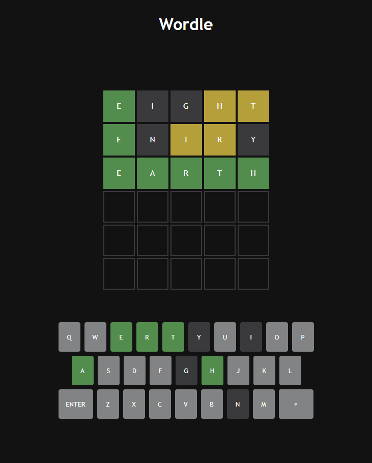

<h1>Wordle Clone in JavaScript!<h1>

  

<h3>What is Wordle?</h3>

워들은 2021년 10월 조시 워들이 공개한 영어 단어 맞추기 게임이다. 게임 이름은 '단어'를 뜻하는 Word와 자신의 성 Wardle을 섞어 지은 것이다.

<h5>This clone project: <a href="https://heina-effect.github.io/wordle-javascript/">here</a></h5>

개발목표 : 
 JavaScript 및 API를 사용하여 Wordle 게임을 완성하고, API 사용법을 익혀보자 
  
 <h5>사용기술: HTML, CSS, JavaScript, Node.js, express, axios, Random API</h5>
  
  
 개선사항: 

1. Dictionary API 이용하여 사전에 단어 입력시 경고메세지 나타내기 (유료API라 보류)  
2. 부드러운 애니메이션 효과 주기 
3. react, typescript 업그레이드 
